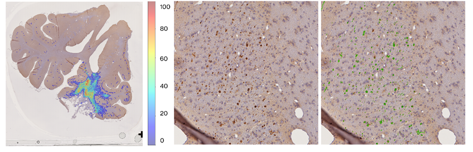

# PIGMENT: Porcine Immunohistochemistry Segmentation

PIGMENT is a deep learning workflow for automated segmentation and quantification of amyloid precursor protein (APP)-positive pathology in porcine white-matter immunohistochemistry whole-slide images.

The workflow uses a SegFormer-B0 semantic segmentation model on 512 × 512 histology tiles and generates slide-level outputs such as APP prediction masks, stitched overlays, cluster-count heatmaps, and quality-control panels.

---

## Repository

Clone the repository first:

```bash
git clone https://github.com/dadashkarimi/pigment.git
cd pigment
```

The repository contains training and inference notebooks, training scripts, environment files, pretrained/checkpoint folders, and documentation figures.

Important repository paths include:

```text
APP-inference-notebooks/
docs/figures/
segformer-rerun-equal-epochs/
environment.yml
requirements.txt
run.sh
train_segformer.py
train_segformer_no_augmentation.py
```

The example output image used in this README is expected at:

```text
docs/figures/pigment_container_outputs.png
```

---

## What PIGMENT Does

PIGMENT takes a whole-slide image as input and produces:

- tissue/background masks for filtering slide regions
- 512 × 512 histology tiles from tissue-containing regions
- tile-level APP-positive prediction masks
- stitched whole-slide prediction masks
- green APP prediction overlays
- APP cluster-count heatmaps
- high- and low-signal quality-control panels
- metadata files for reproducibility and downstream analysis

The workflow is designed for APP histology analysis where the key goal is to detect and localize sparse, fragmented, and morphologically variable APP-positive axonal pathology.

---

## Expected Container Outputs

The figure below shows representative outputs expected from the containerized PIGMENT workflow.

It is included as a visual reference so users can quickly understand what a successful run should produce: a whole-slide APP cluster heatmap, a histology tile, and a PIGMENT prediction overlay.



This image is intentionally included because it shows the scientific outputs expected from the container. It is more useful than screenshots of local folders, machine-specific paths, or development directories.

---

## Supported Input Formats

The container supports whole-slide images in:

```text
.svs
.ndpi
```

Example input files:

```text
sample_slide.svs
sample_slide.ndpi
```

---

## Model Directory

The `--model_dir` argument must point to a trained PIGMENT checkpoint directory.

After cloning this repository, an example checkpoint path is:

```text
segformer-rerun-equal-epochs/E1Round3/PushkarA07_segformer-b0-finetuned-net-15Oct/checkpoint-20260220-v2
```

That checkpoint directory should contain files such as:

```text
config.json
model.safetensors
optimizer.pt
rng_state.pth
scheduler.pt
trainer_state.json
training_args.bin
```

For container runs, the same repository-local checkpoint path becomes visible inside the container through the bind mount. For example, if the repository is bound to `/workspace`, use:

```bash
--model_dir /workspace/segformer-rerun-equal-epochs/E1Round3/PushkarA07_segformer-b0-finetuned-net-15Oct/checkpoint-20260220-v2
```

At minimum, the checkpoint directory must contain:

```text
config.json
model.safetensors
```

The model weights are not inferred from the slide file. They must be provided through `--model_dir`.

---

## Container

The expected container file is:

```text
pigment_wsi.sif
```

If the container is not already present after cloning, download or build it separately and place it in the repository root:

```text
pigment/
├── pigment_wsi.sif
├── segformer-rerun-equal-epochs/
├── docs/
└── README.md
```

The container provides three command modes:

```bash
apptainer run pigment_wsi.sif pipeline  [recommended full workflow]
apptainer run pigment_wsi.sif proc      [main prediction workflow only]
apptainer run pigment_wsi.sif postproc  [QC panel generation only]
```

Recommended use is:

```bash
apptainer run pigment_wsi.sif pipeline ...
```

In `pipeline` mode, the container first runs the main prediction workflow and then runs the post-processing/QC workflow.

---

## Prepare an Input Folder

Create a simple project layout inside the cloned repository:

```bash
mkdir -p input output
```

Place your whole-slide image in:

```text
input/
```

Example:

```text
input/sample_slide.ndpi
```

---

## Recommended Full Pipeline Run

From the repository root:

```bash
apptainer run --nv \
  --bind "$PWD":/workspace \
  pigment_wsi.sif pipeline \
  --input /workspace/input/sample_slide.ndpi \
  --model_dir /workspace/segformer-rerun-equal-epochs/E1Round3/PushkarA07_segformer-b0-finetuned-net-15Oct/checkpoint-20260220-v2 \
  --outdir /workspace/output/sample_slide \
  --tile_size 512 \
  --level 0 \
  --maskpy_work_max_dim 3072 \
  --maskpy_k 12 \
  --min_mask_fraction 0.20 \
  --batch_size 8 \
  --fp16 \
  --skip_background \
  --save_tile_masks \
  --heatmap_threshold 7 \
  --heatmap_min_cluster_area 5 \
  --min_mask_fraction_for_heatmap 0.20 \
  --slide_name sample_slide \
  --overlay_alpha 0.45 \
  --low_mode lowest_nonzero
```

For an SVS slide, change only the input path:

```bash
--input /workspace/input/sample_slide.svs
```

For a new slide, update:

```bash
--input /workspace/input/YOUR_SLIDE.svs_or_ndpi
--outdir /workspace/output/YOUR_SLIDE_NAME
--slide_name YOUR_SLIDE_NAME
```

---

## Minimal Test Run

Use this to confirm that the container, model, and bind paths are working:

```bash
apptainer run --nv \
  --bind "$PWD":/workspace \
  pigment_wsi.sif pipeline \
  --input /workspace/input/sample_slide.ndpi \
  --model_dir /workspace/segformer-rerun-equal-epochs/E1Round3/PushkarA07_segformer-b0-finetuned-net-15Oct/checkpoint-20260220-v2 \
  --outdir /workspace/output/test_run \
  --tile_size 512 \
  --level 0 \
  --batch_size 4 \
  --save_tile_masks \
  --slide_name test_run
```

After completion, inspect:

```text
output/test_run/
```

---

## Example Slurm Run

For large whole-slide images, GPU inference is recommended.

```bash
sbatch \
  --job-name=pigment_wsi \
  --partition=gpu \
  --gres=gpu:1 \
  --cpus-per-task=8 \
  --mem=64G \
  --time=08:00:00 \
  --wrap="apptainer run --nv \
    --bind $PWD:/workspace \
    pigment_wsi.sif pipeline \
    --input /workspace/input/sample_slide.ndpi \
    --model_dir /workspace/segformer-rerun-equal-epochs/E1Round3/PushkarA07_segformer-b0-finetuned-net-15Oct/checkpoint-20260220-v2 \
    --outdir /workspace/output/sample_slide \
    --tile_size 512 \
    --level 0 \
    --maskpy_work_max_dim 3072 \
    --maskpy_k 12 \
    --min_mask_fraction 0.20 \
    --batch_size 8 \
    --fp16 \
    --skip_background \
    --save_tile_masks \
    --heatmap_threshold 7 \
    --heatmap_min_cluster_area 5 \
    --min_mask_fraction_for_heatmap 0.20 \
    --slide_name sample_slide \
    --overlay_alpha 0.45 \
    --low_mode lowest_nonzero"
```

Use the GPU partition and GPU request appropriate for your cluster.

---

## Pipeline Modes

### `pipeline`

Runs the complete workflow:

```text
proc.py → postproc.py
```

This is the recommended mode for most users.

```bash
apptainer run --nv \
  --bind "$PWD":/workspace \
  pigment_wsi.sif pipeline \
  --input /workspace/input/sample_slide.ndpi \
  --model_dir /workspace/segformer-rerun-equal-epochs/E1Round3/PushkarA07_segformer-b0-finetuned-net-15Oct/checkpoint-20260220-v2 \
  --outdir /workspace/output/sample_slide \
  --slide_name sample_slide
```

### `proc`

Runs the main prediction workflow only:

```text
whole-slide image
→ tissue mask generation
→ mask-aware tiling
→ SegFormer prediction
→ stitched masks
→ heatmaps
```

```bash
apptainer run --nv \
  --bind "$PWD":/workspace \
  pigment_wsi.sif proc \
  --input /workspace/input/sample_slide.ndpi \
  --model_dir /workspace/segformer-rerun-equal-epochs/E1Round3/PushkarA07_segformer-b0-finetuned-net-15Oct/checkpoint-20260220-v2 \
  --outdir /workspace/output/sample_slide
```

### `postproc`

Runs QC panel generation using existing prediction outputs:

```text
prediction metadata / cluster counts
→ highest-cluster QC panel
→ lowest-signal QC panel
```

```bash
apptainer run \
  --bind "$PWD":/workspace \
  pigment_wsi.sif postproc \
  --skip_prediction \
  --outdir /workspace/output/sample_slide \
  --slide_name sample_slide \
  --tile_size 512 \
  --overlay_alpha 0.45 \
  --low_mode lowest_nonzero
```

---

## Main Arguments

| Argument | Description |
|---|---|
| `--input` | Input `.svs` or `.ndpi` whole-slide image. |
| `--model_dir` | Trained PIGMENT checkpoint directory containing `config.json` and `model.safetensors`. |
| `--outdir` | Output directory for all generated files. |
| `--slide_name` | Slide identifier used in output folder and file names. If omitted, it is inferred from the input filename. |
| `--tile_size` | Tile size for inference. The standard value is `512`. |
| `--level` | OpenSlide pyramid level used for tiling. Default is `0`. |
| `--batch_size` | Number of tiles per inference batch. |
| `--device` | Device selection for prediction: `auto`, `cuda`, or `cpu`. |
| `--fp16` | Enables half-precision inference when running on GPU. |
| `--skip_background` | Skips mostly white/background tiles. |
| `--save_tile_masks` | Saves tile-level predicted APP masks. |
| `--reuse_tiles` | Reuses existing tile metadata and tile images if available. |
| `--jpeg_quality` | JPEG quality used for saved tile images. |
| `--white_threshold` | Pixel intensity threshold used by the white/background filter. |
| `--white_fraction` | Fraction of white pixels required to classify a tile as background. |

---

## Tissue Mask and Mask-Aware Tiling Arguments

Before prediction, the pipeline creates a low-resolution tissue/brain mask. This tissue mask is used to avoid running inference on irrelevant background regions.

| Argument | Description |
|---|---|
| `--maskpy_work_max_dim` | Maximum dimension of the working image used for tissue-mask generation. Default is `3072`. |
| `--maskpy_k` | Number of Gaussian mixture components used by the tissue-mask workflow. Default is `12`. |
| `--maskpy_work_dir` | Optional directory for cached working images. |
| `--maskpy_no_cache` | Disables reuse of cached maskpy working images. |
| `--maskpy_overwrite_cache` | Forces regeneration of cached maskpy working images. |
| `--maskpy_keep_labels` | Optional comma-separated GMM labels to retain. Empty means all tissue/brain mask regions are used. |
| `--precomputed_mask` | Optional precomputed FULL_WORKING `.npy` mask. If provided, tissue-mask generation is skipped. |
| `--min_mask_fraction` | Minimum fraction of tissue mask overlap required to keep a tile. Default is `0.20`. |

---

## Stitching, Overlay, and Postprocessing Arguments

| Argument | Description |
|---|---|
| `--stitch_scale` | Scale used for stitched slide-level outputs. Default is `0.25`. |
| `--overlay_alpha` | Transparency of green prediction overlay. Default is `0.45`. |
| `--no_overlay` | Disables stitched overlay generation. |
| `--no_postprocess` | Disables morphological postprocessing of predicted masks. |
| `--min_area` | Minimum component area used for large elongated false-positive filtering. Default is `2300`. |
| `--elong_thresh` | Elongation threshold used for false-positive filtering. Default is `3.0`. |

---

## Heatmap Arguments

| Argument | Description |
|---|---|
| `--no_heatmap` | Disables heatmap generation. |
| `--heatmap_threshold` | Cluster-count threshold used for heatmap visualization. Default is `7`. |
| `--heatmap_scale` | Scale used for heatmap outputs. If omitted, the stitch scale is used. |
| `--heatmap_alpha` | Transparency of heatmap overlay. Default is `0.45`. |
| `--heatmap_dilate_iterations` | Number of dilation iterations used before cluster counting. Default is `2`. |
| `--heatmap_min_cluster_area` | Minimum connected-component area counted as a cluster. Default is `5`. |
| `--min_mask_fraction_for_heatmap` | Minimum tile mask fraction required for heatmap cluster counting. Default is `0.20`. |

---

## QC Panel Arguments

| Argument | Description |
|---|---|
| `--low_mode lowest_nonzero` | Selects the lowest tile with cluster count greater than zero for low-signal QC. |
| `--low_mode lowest_any` | Allows zero-count tiles for low-signal QC. |
| `--allow_incomplete_3x3` | Allows QC panels to be generated even when a full 3 × 3 tile neighborhood is not available. |

The QC panel step generates raw-vs-overlay 3 × 3 panels centered on representative high- and low-signal tiles.

---

## Output Folder Structure

Typical output structure:

```text
output_directory/
├── heatmaps/
├── maskpy_mask/
├── maskpy_work_cache/
├── pigment_qc_cluster_panels/
├── pred_masks/
├── stitched/
└── tiles/
```

---

## Important Output Files

### Tissue mask outputs

```text
maskpy_mask/
├── <sample>_<class>_brain_mask_FULL_WORKING.png
├── <sample>_<class>_brain_mask_all_tissue_FULL_WORKING.npy
├── <sample>_<class>_brain_mask_all_tissue_FULL_WORKING.png
├── <sample>_<class>_label_map_FULL_WORKING.npy
├── <sample>_<class>_label_map_FULL_WORKING.png
└── <sample>_<class>_brain_mask_all_tissue_metadata.json
```

These files describe the tissue/brain mask used to decide which slide regions are tiled and predicted.

### Tile outputs

```text
tiles/
└── <slide_name>/
    ├── tile_metadata.csv
    ├── slide_info.json
    └── <slide_name>_r00000_c00000.jpg
```

The tile metadata records row, column, slide coordinates, mask fraction, and tile paths.

### Prediction outputs

```text
pred_masks/
└── <slide_name>/
    ├── prediction_metadata.csv
    └── <slide_name>_r00000_c00000_pred.png
```

The prediction metadata links each tile to its APP-positive prediction mask.

### Stitched outputs

```text
stitched/
└── <slide_name>/
    ├── <slide_name>_stitched_pred_mask_level0_scale0p25.tiff
    └── <slide_name>_overlay_green_level0_scale0p25.tiff
```

The stitched mask and green overlay summarize APP predictions at slide level.

### Heatmap outputs

```text
heatmaps/
└── <slide_name>/
    ├── <slide_name>_cluster_counts.csv
    ├── <slide_name>_cluster_count_grid.npy
    ├── <slide_name>_cluster_heatmap_only_level0.png
    ├── <slide_name>_cluster_heatmap_overlay_level0_scale0p25.png
    └── <slide_name>_cluster_heatmap_overlay_level0_scale0p25.tiff
```

The cluster-count heatmap shows spatial variation in predicted APP-positive burden across the slide.

### QC panel outputs

```text
pigment_qc_cluster_panels/
└── <slide_name>/
    └── 3x3_raw_left_overlay_right/
        ├── images/
        │   ├── <slide_name>__highest_cluster_count_tile__3x3__raw_left_overlay_right__center_rXXXXX_cXXXXX__clusters_XXXXXX.tif
        │   └── <slide_name>__lowest_nonzero_cluster_count_tile__3x3__raw_left_overlay_right__center_rXXXXX_cXXXXX__clusters_XXXXXX.tif
        └── metadata/
            ├── <slide_name>__highest_cluster_count_tile__metadata.csv
            └── <slide_name>__lowest_nonzero_cluster_count_tile__metadata.csv
```

Each QC TIFF shows the raw 3 × 3 tile neighborhood on the left and the same region with green APP prediction overlay on the right.

---

## Interpreting the Outputs

| Output | Meaning |
|---|---|
| `tiles/` | Saved 512 × 512 histology tiles selected for inference. |
| `pred_masks/` | Tile-level APP-positive prediction masks. |
| `stitched/` | Slide-level reconstructed masks and overlays. |
| `heatmaps/` | APP cluster-density maps across the slide. |
| `maskpy_mask/` | Tissue/background masks used to filter tile prediction regions. |
| `pigment_qc_cluster_panels/` | Representative high- and low-signal QC panels. |

The expected visual appearance of the main outputs is shown in:

```text
docs/figures/pigment_container_outputs.png
```

---

## Notes on Output Formats

Input slides are read from `.svs` or `.ndpi` files.

Final stitched masks, overlays, heatmaps, and QC panels are written as TIFF/PNG/CSV/NPY outputs. The pipeline does not write final results back into true vendor-specific `.svs` or `.ndpi` files.

This is intentional because TIFF-compatible outputs are more portable for downstream visualization and analysis.

---

## Optional Local Python Environment

The repository includes:

```text
requirements.txt
environment.yml
```

These files are useful for local notebook or training work. The container is still recommended for whole-slide inference because it packages the WSI libraries and runtime dependencies needed by the pipeline.

A minimal local install can be started with:

```bash
pip install -r requirements.txt
```

For full containerized WSI inference, use `pigment_wsi.sif`.

---

## Training

Training scripts and notebooks are included in the repository, including:

```text
run.sh
train_segformer.py
train_segformer_no_augmentation.py
APP_training_clean.ipynb
```

The training workflow uses Hugging Face dataset IDs and writes outputs under:

```text
segformer-rerun-equal-epochs/
```

For inference with the provided checkpoint, training is not required.

---

## Troubleshooting

### The container cannot find the model

Check that the repository has been cloned and that the checkpoint directory exists.

From the repository root, verify:

```bash
ls segformer-rerun-equal-epochs/E1Round3/PushkarA07_segformer-b0-finetuned-net-15Oct/checkpoint-20260220-v2
```

You should see:

```text
config.json
model.safetensors
trainer_state.json
training_args.bin
```

When running inside the container with:

```bash
--bind "$PWD":/workspace
```

the model path should be:

```bash
--model_dir /workspace/segformer-rerun-equal-epochs/E1Round3/PushkarA07_segformer-b0-finetuned-net-15Oct/checkpoint-20260220-v2
```

### The output folder is empty

Check that `--outdir` points to a writable path inside the bind mount.

Example:

```bash
--bind "$PWD":/workspace
--outdir /workspace/output/sample_slide
```

### The job runs on CPU

Use `--nv` with Apptainer and request a GPU from the scheduler.

Example:

```bash
apptainer run --nv ...
```

For Slurm, include a GPU request such as:

```bash
--gres=gpu:1
```

### Very few tiles are predicted

Try lowering the tissue mask overlap threshold:

```bash
--min_mask_fraction 0.05
```

or disable white-tile skipping by removing:

```bash
--skip_background
```

### QC panel generation fails near slide boundaries

Use:

```bash
--allow_incomplete_3x3
```

---

## Citation

If you use this repository, model, or containerized workflow, please cite the associated PIGMENT publication.
